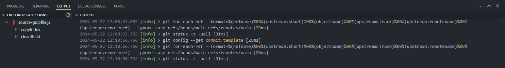

# Gulp Tasks

I use [Gulp Tasks](https://marketplace.visualstudio.com/items?itemName=nickdodd79.gulptasks) with [Visual Studio Code](https://code.visualstudio.com/download) to automate development tasks. Despite my efforts, I’ve given up on making this add-on fully compatible with every Integrated Development Environment (IDE). The ongoing challenges and compatibility issues have proven to be more trouble than they’re worth, leading me to seek other solutions.

---

## Project Installation

> 🠋 The [gulpfile.js](https://github.com/TertiusRoach/development-portfolio_4.00/blob/main/source/gulpfile.js) document encodes and transfers design files.

    npm r -g -D gulp
    npm install --save-dev del
    npm install --save-dev gulp
    npm install --save-dev sass
    npm install --save-dev gulp
    npm install --save-dev gulp-sass
    npm install --save-dev gulp-exec
    npm install --save-dev gulp-clean
    npm install --save-dev gulp-concat
    npm install --save-dev gulp-uglify
    npm install --save-dev gulp-rename
    npm install --save-dev gulp-ignore
    npm install --save-dev gulp-base64
    npm install --save-dev gulp-terser
    npm install --save-dev gulp-htmlmin
    npm install --save-dev gulp-readdir
    npm install --save-dev gulp-uglifycss
    npm install --save-dev gulp-typescript
    npm install --save-dev gulp-sourcemaps
    npm install --save-dev gulp-delete-file
    npm install --save-dev gulp-autoprefixer
    npm install --save-dev gulp-append-prepend
    npm install --save-dev gulp-string-replace
    npm install --save-dev gulp-remove-html-comments

---

### Final Output

Working with Gulp tasks can feel like being in an abusive relationship. Initially, Gulp appears to be an effective way to automate tasks and manage your project. You’re learning JavaScript with tangible results, and everything seems fine. However, as time goes on, the darker sides start to show. The relationship reveals its flaws, much like how an abusive partner might isolate you. Gulp traps you in a web of dependencies. You start with a few packages, but soon find yourself needing more. What initially seems manageable quickly becomes unmanageable. This is the dependency trap. Although Gulp is useful for learning JavaScript with concrete outputs, the increasing complexity can be discouraging. I've stored my old code here, thinking I might resurrect this old tech one day, but I doubt it. If you encounter any issues, I’ve switched over to [webpack](https://webpack.js.org/).

Your output should display the following:

---
